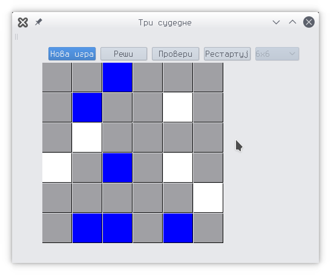
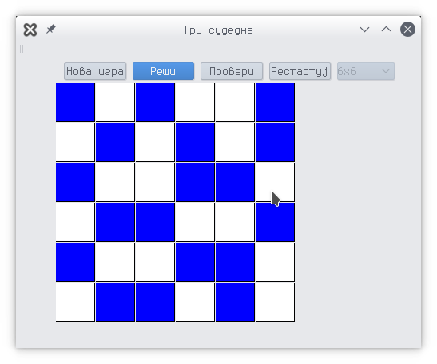

# The PuzzleWorld

Qt5 based program which uses smt solver to generate logical puzzles, confirm that their solution is unique and let's user play!

### Planned games

#### 3 in a row

- Fill the grid with Blue and White squares
- A 3-In-A-Row (or column) of the same colour is not allowed
- Each row and column has an equal number of Blue and White squares

You can find [here](https://www.brainbashers.com/3inarow.asp) more about the game.

#### ABC path

- Enter every letter from A to Y into the grid
- Each letter is next to the previous letter either horizontally, vertically or diagonally
- The clues around the edge tell you which row, column or diagonal each letter is in

You can find [here](https://www.brainbashers.com/abcpath.asp) more about the game.

#### Hitori

- Eliminate numbers until there are no duplicates in any row or column
- Eliminate numbers by marking them in Black
- You are not allowed to have two Black squares touching horizontally or vertically (diagonally is ok)
- Any White square can be reached from any other (i.e. they are connected)

You can find [here](https://www.brainbashers.com/hitori.asp) more about the game.

#### Qt5 application
Here are some screenshots.

:x

### How to compile
Make sure you have:
- Qt5
- qmake
- [Yices smt solver](http://yices.csl.sri.com/) (add yices-smt2 to PATH)
- g++ or clang++
